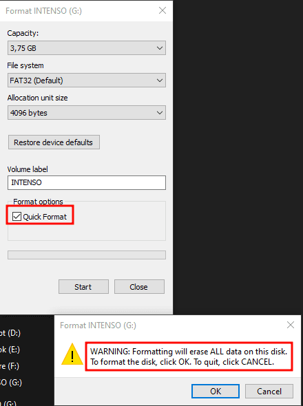
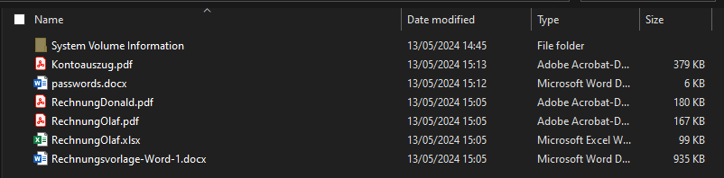
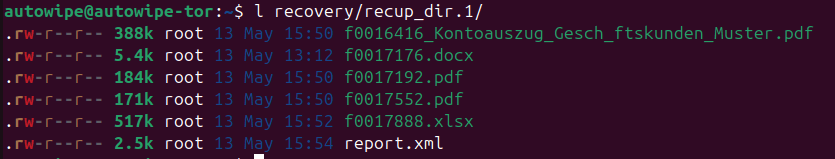
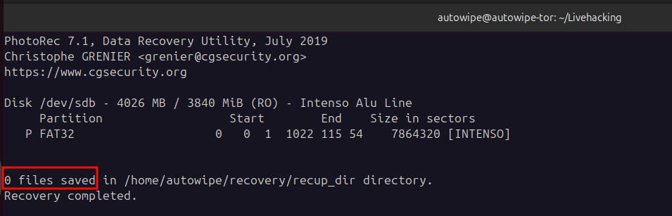

# Dangers of USB Drives - Often Forgotten: Secure Erasure Before Passing Them On

# Table of Contents
# Introduction

Why are we writing this blog post today? Is the topic new? Technically demanding? No, none of that. The reason is simple: Recently, we experienced in a private context that many people are not familiar with this issue. Since the consequences can be far-reaching, the purpose of this post is simply to raise awareness.

In our case, we received a USB stick in a private setting. The stick did not work for the person who gave it to us, but it was supposed to contain a file with important information. The request was to try to recover the file.

This post will not be very technical or long, but aims solely to make readers aware of the issue.

Most of us have heard it enough by now: "Don't just plug any USB stick into your device" has almost become a mantra. In our perception, most people are indeed aware of this and follow it.

What is often forgotten, however, is that USB sticks can also pose dangers when we pass them on ourselves. Is it enough to simply delete the existing data? Format the stick? Quick format or "slow" format? Today, we provide a brief overview of these questions.

# What is the actual problem?
In my circle, USB sticks are mostly used as a medium for data transfer. That's fine in itself. However, many people do not consider securely deleting the data. It is often assumed that simply deleting or formatting is sufficient. Unfortunately, this is not always the case.

## Simple Deletion

When files are simply deleted, the data is not actually removed. The storage space the file occupies is merely marked as free. This means that the data physically remains on the storage device 
and can be easily recovered with the right tools.

## Quick Format

Windows offers the option to perform a quick format. It looks like this:

During a quick format, only the file system of the storage device is recreated. The actual data remains on the storage device and can also be recovered with suitable tools.
## Full Format

To perform a full (slow) format, simply uncheck the quick format option.
A full format takes longer because it overwrites the entire storage area. While this makes the data harder to access, it does not make it completely unreadable. Specialized data recovery tools can still recover data even after a full format.
In our test, a normal format was sufficient to thwart most free tools, making it likely adequate for many use cases (not too sensitive data).

# Data Recovery with a Tool

To demonstrate data recoverability, we used a well-known tool called  [photorec](https://www.cgsecurity.org/wiki/PhotoRec). [photorec](https://www.cgsecurity.org/wiki/PhotoRec) is a free data recovery tool that can recover deleted files from USB sticks, hard drives, and other storage devices. We have had good results with this tool in the past. Since it is free and included in the Testdisk suite in package managers like Ubuntu's, it is always worth a try.

For the demo, we created a stick with the following files:

The data can be fully recovered after both "normal" deletion and quick formatting (as mentioned earlier, the data is still on the storage device; the system simply marks the space as available for writing again. Only the file metadata is actually deleted).

Metadata, such as file names, is mostly lost. However, this is generally not a problem.

Something similar must have happened in the case of our acquaintance. The stick from which we were able to recover the desired file contained numerous sensitive data. This could have had enormous implications for various parties, as there were professional customer data present.

To prevent trivial recovery, normal formatting usually suffices.

# Secure Data Deletion

There are various methods to securely delete data and prevent recovery:

- Encryption: Encrypt sensitive storage media. Even if something is recovered, it is unreadable without the correct key. In our opinion, this is the preferred method to protect your data.
- Multiple Overwrites: Use software that overwrites the storage area multiple times with random data. However, it should be noted that not all storage areas that once contained data may be reached and overwritten. Therefore, we still consider encrypting data to be the best option.
- Physical Destruction: If the USB stick is no longer needed, physically destroying the storage chips can ensure that the data cannot be recovered. For home users or small companies without really sensitive data this is probably not a realistic option.
