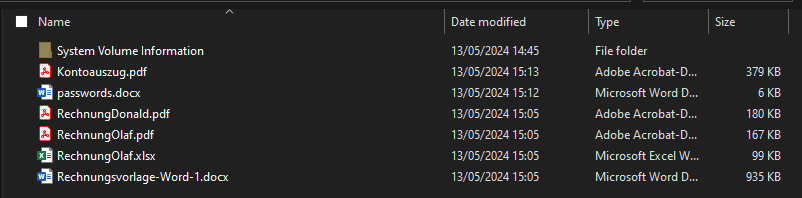
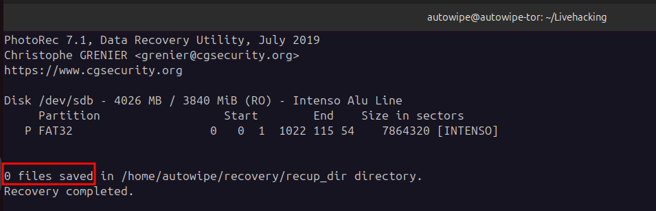

Gefahren von USB-Sticks - Oft vergessen: Sicheres löschen vor der Weitergabe

# Inhaltsverzeichnis
# Einführung

Warum schreiben wir heute diesen Blogpost? Ist das Thema neu? Technisch anspruchsvoll? Nein, nichts davon. Der Grund ist einfach: Wir haben im privaten Umfeld zuletzt erlebt, dass dieses Thema vielen nicht geläufig ist. Da die Auswirkungen allerdings weitläufig sein können, ist der Grund für diesen Post schlichtweg Aufklärung.

In unserem Fall haben wir einen USB-Stick im privaten Umfeld erhalten. Der Stick hat bei besagter Person nicht funktioniert, sollte aber eine Datei mit wichtigen Informationen enthalten. Die Bitte war demnach, zu versuchen, die Datei wiederherzustellen.

Der Post wird nicht sonderlich technisch oder lang werden, sondern zielt wirklich nur darauf ab, die Leser zu sensibilisieren.

Die meisten von uns haben es mittlerweile zur Genüge gehört: "Steckt nicht einfach irgendeinen USB-Stick in euer Endgerät" ist mittlerweile fast zum Mantra geworden. In unserer Wahrnehmung ist das auch wirklich fast allen bekannt und wird auch beherzigt.

Was dabei aber oft vergessen wird, ist, dass USB-Sticks auch Gefahren bergen, wenn wir sie selbst weitergeben. Reicht es, die vorhandenen Daten einfach zu löschen? Den Stick zu formatieren? Schnellformatierung oder "langsame" Formatierung? Hierzu geben wir heute eine kurze Übersicht.

# Was ist eigentlich das Problem?

USB-Sticks werden in meinem Umfeld von den meisten als Medium zur Datenweitergabe verwendet. Das ist soweit ja auch in Ordnung. Woran viele aber nicht denken, ist das sichere Löschen der Daten. Oft wird angenommen, dass das einfache Löschen oder Formatieren ausreicht. Leider ist das nicht immer der Fall.

## Einfaches Löschen

Beim einfachen Löschen von Dateien werden die Daten nicht wirklich entfernt. Der Speicherplatz, den die Datei einnimmt, wird lediglich als frei markiert. Das bedeutet, dass die Daten weiterhin physisch auf dem Speichergerät vorhanden sind und mit den richtigen Tools leicht wiederhergestellt werden können.

## Schnellformatierung

Windows bietet die Möglichkeit, eine Schnellformatierung vorzunehmen. Das sieht so aus:

Bei der Schnellformatierung wird lediglich das Dateisystem des Speichergeräts neu erstellt. Die eigentlichen Daten bleiben auf dem Speichergerät und können ebenfalls mit geeigneten Tools wiederhergestellt werden.

## Vollständige Formatierung

Für die vollständige Formatierung wird lediglich der Haken für die Schnellformatierung entfernt.
Eine vollständige Formatierung dauert länger, weil sie den gesamten Speicherbereich überschreibt. Dadurch werden die Daten zwar schwerer zugänglich, aber auch nicht vollkommen unlesbar. Es gibt spezialisierte Datenrettungstools, die auch nach einer vollständigen Formatierung Daten wiederherstellen können.
In unserem Test reichte das normale Formatieren allerdings für die meisten freien Tools aus und ist somit vermutlich auch für viele Anwendungsfälle (nicht allzu sensible Daten) aus.

# Wiederherstellung mit einem Tool

Um die Wiederherstellbarkeit von Daten zu demonstrieren, haben wir ein bekanntes Tool namens [photorec](https://www.cgsecurity.org/wiki/PhotoRec) verwendet. [photorec](https://www.cgsecurity.org/wiki/PhotoRec) ist ein kostenfreies Datenrettungstool, das gelöschte Dateien auf USB-Sticks, Festplatten und anderen Speichergeräten wiederherstellen kann. Wir hatten in der Vergangenheit bereits gute Ergebnisse mit dem Tool erzielt. Da es kostenlos ist und bei Betriebssystemen wie Ubuntu auch in der Testdisk-Suite in der Paketverwaltung enthalten ist, ist es eigentlich immer einen Versuch wert. 

Für die Demo haben wir einen Stick mit den folgenden Dateien erstellt:

Die Daten können sowohl nach dem "normalen" löschen, als auch nach der Schnellformatierung vollständig wiederhergestellt werden (wie bereits gesagt, die Daten sind ja einfach noch auf dem Speichergerät, im Prinzip sagt das System lediglich "hier ist wieder Platz und kann wieder geschrieben werden". Aber nur die Datei-Metadaten werden wirklich gelöscht).

Metadaten wie beispielweise die Dateinamen gehen dabei größtenteils verloren. Was aber natürlich kein Problem ist.

Etwas ähnliches muss im Fall unseres Bekannten passiert sein. Der Stick, auf dem wir die gewünschte Datei wiederherstellen konnten, beinhaltete nämlich massenhaft sensible Daten. Diese hätten enorme Auswirkungen auf verschiedenste Parteien haben können, da berufliche Kundendaten zu finden waren.

Um eine triviale Wiederherstellung zu verhindern, reicht das in der Regel bereits aus. 

# Sicheres Löschen von Daten

Um Daten sicher zu löschen und eine Wiederherstellung zu verhindern gibt es verschiedene Methoden:

- Verschlüsselung: Verschlüsseln Sie sensible Datenspeicher. Selbst wenn etwas wiederhergestellt werden kann, ist es ohne den richtigen Schlüssel nicht lesbar. Das ist unserer Meinung nach die beste Methode, Ihre Daten zu schützen
- Mehrfaches Überschreiben: Nutzen Sie Software, die den Speicherbereich mehrfach mit zufälligen Daten überschreibt. Man muss allerdings beachten, dass es hierbei sein kann, dass nicht alle Speicherbereiche die schon einmal Daten enthalten haben erreicht werden und geschrieben werden können. Daher halten wir das Verschlüsseln von Daten immer noch für die beste Option.
- Physische Zerstörung: Wenn der USB-Stick nicht mehr benötigt wird, kann eine physische Zerstörung der Speicherchips sicherstellen, dass die Daten nicht wiederhergestellt werden können. Für den Heimanwender und auch die meisten Firmen, die nicht gerade mit hochsensiblen Daten arbeiten, ist das aber vermutlich eher keine Option und auch nicht sinnvoll.
