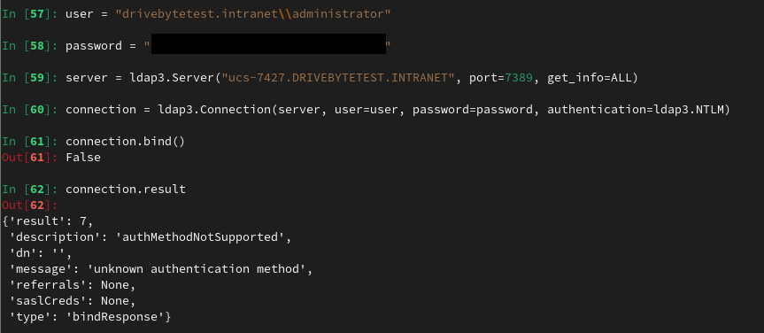
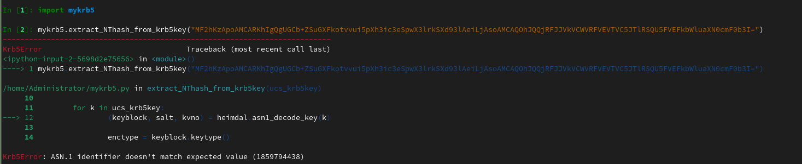

# Simple yet effective. The story of some simple bugs that led to the complete compromise of a network

# Table of Contents
# Introduction

Recently, DriveByte was assigned to perform a penetration test for a customer. The goal was to find as many vulnerabilities as possible, as well as to determine, if an attacker would be able to compromise the customer’s infrastructure.
The unusual part about it? The customer’s IT had no Microsoft Active Directory nor Entra ID but something similar. It was based on a product called [UCS](https://www.univention.com/products/ucs/), which is according to their website, a solution for "easy and centralized administration of domains".
This was especially interesting for us, as we did not know this solution before and are of course always genuinely interested in digging into new technologies.
The following blogpost shows a very classic and simple flaw, that had a huge impact on the customer's environment.

Since the initial publication of this blogpost, some changes have been made. This includes especially some additional information that we received from Univention. For better tracking we added a section "Update History". Special thanks again to Univention for the awesome information and collaboration!

## TLDR
By spying on the process creation of a UCS connected server with extensive permissions, it was possible to gather a large amount of LDAP data. This data includes different credentials and other authentication information.
The vendor responded extremely professional and fixed the issues very quickly. He did not only fix the script where we found the issue, but also checked their code base for similar problems and fixed them as well.

# Do the basics. They might reward you with some quick wins!

The vulnerability analysis was performed with access to the customer’s network and a user with very limited permissions (domain joined, but nothing else).
While enumerating the network, we found that it is possible to access several servers with our basic user via SSH (remember, the network is mainly based on Linux machines, with only a very small number of Windows and Mac machines).
This was possible due to faulty configured permissions and is not a default setting or problem of UCS, but a configuration error. We know this kind of misconfigurations from Windows Active Directory environments, where we often see permissions for "authenticated users" for SMB, RDP and so on.

Of course, this was a very easy entry point and we started to dig into the machines to see if there is anything juicy to be found. Before trying to escalate privileges, we first checked for secrets and so on. Also, for chances of a quick win, we usually start monitoring process creations, to check for privilege escalation opportunities and other valuable information (hell yeah, full HackTheBox/OSCP style!!!). By searching through the system, we discovered the files `/etc/ldap.secret` and `/etc/machine.secret`. This sounded like relevant information. Sadly, we couldn’t read the files, as they were set to read/write-only by root. Also, we didn't know what they are used for, but suspected them to be part of the Univention software. A quick search through the [extensive Univention documentation](https://docs.software-univention.de/developer-reference/5.0/en/ldap.html) proved this assumption right. 
After publishing this blogpost, Univention contacted us again and hinted us to [this](https://forge.univention.org/bugzilla/show_bug.cgi?id=47455) discussion about a solution for the `machine.secret` and `ldap.secret`files. As they identified this files as a possible attack surface, they are planning to find another solution for this. So a solution is in the making.

We played around a little with some of the Univention scripts etc., but at first did not find anything that seemed promising. So, the next step was to check for privilege escalation.
Next to other approaches, we went back to the process creation monitoring, and there it was:


The script `check_univention_joinstatus` requested the LDAP database as the system account, presenting the password in cleartext. We suspected that this might be the password from the `/etc/machine.secret` file which was later confirmed.
So, the logical next step for us was to recreate this exact command from our attacker machine. We were quite surprised to see, that this machine had permissions to basically perform `DCSync`. It's not Windows AD of course. The machine had the permission to retrieve ALL directory objects _with all their attributes_. This includes users, with their krb5key, sambaNTPassword (NTHash), [SHA512 or bcrypt hashes](https://docs.software-univention.de/manual/5.0/en/domain-ldap/password-hashes.html) (SHA512 is the default) as well as their password history. The following screenshot shows the output we recreated in a lab environment:


However, this is only possible if the domain joined system has the permissions that match `DCSync`. In our test environment we joined an arbitrary machine to the domain and checked what information we get back from the "Domain Controller". So, in comparison to the information above, you can see in the screenshot below what information a usual domain joined system gets:


# Exploitation attempt 1: LDAP

To exploit this issue, we can rely on [n00py's awesome "Alternative ways to Pass the Hash (PtH)" blogpost](https://www.n00py.io/2020/12/alternative-ways-to-pass-the-hash-pth/).
However, a bit more research on that topic showed, that it is not as simple as we first thought. Our first guess was, that we can just use the LDAP3 Python module to connect to LDAP with the NTLM hash. Unfortunately, that seems to be impossible with Univention, as it is not supporting NTLM authentication for LDAP:



While our first impression was, that we are doing something wrong, [this](https://github.com/cannatag/ldap3/issues/625#issuecomment-444452103) GitHub entry stated that the "authMethodNotSupported" message is from the server. It seems that Univention does not have NTLM authentication activated on the server by default (atm, we don't know if it is supported at all).

For comparison, the SIMPLE authentication via LDAP is working fine:


But the 'server.info' output is puzzling us a bit because it says that NTLM is a valid SASL mechanism, so maybe there is a workaround by using NTLM for SASL.
Before going too deep into that path and losing a lot of time, we decided to try something else. Maybe this motivates somebody who has more knowledge in this area to dig into it. Or maybe we will come back to this later...

Here we also got some additional information from Univention. NTLM is indeed not supported. The fact that it is still shown as supported sasl mechanism is due to the OpenLDAP defaulf configuration. Univention is tracking this issue [here](https://forge.univention.org/bugzilla/show_bug.cgi?id=43732).

# Exploitation attempt 2: SSH via Kerberos

As an alternative way, [\@n00py](https://twitter.com/n00py1) suggests in his blogpost to use the NThash to sign a Kerberos ticket and then connect via SSH.
Well, that seems easy. So we took the administrator's hash and threw it in [Impacket's ticketer.py](https://github.com/fortra/impacket). All information for this including the domain-sid etc. was included in the full domain dump.

```bash
ticketer.py -nthash 3B0E04870F352EDC0EF120F16431FA42 -domain-sid S-1-5-21-2228799870-4051273110-1256914315 -spn host/ucs-7427.drivebytetest.intranet -domain drivebytetest.intranet Administrator
```

Sadly, the authentication failed with the following message:


As this is no traditional AD, we were thinking that they could use another approach to sign their Kerberos tickets. What was bugging us from the start was the `krb5Key` fields we've seen in the second screenshot.
And again, the Univention documentation comes to our rescue. It states that "[The krb5Key attribute stores the Kerberos password](https://docs.software-univention.de/manual/5.0/en/user-management/password-management.html)".
Nice. But how?

After googling for a while, we came across [this](https://help.univention.com/t/howto-identify-type-of-kerberos-keys/16365) post in the Univention help forum. It contains some very interesting information.
First, the `krb5Key` seems to consist of a keytype, a keyblock, in one case even an NThash and a salt string. Well, now of course we wanted to get our fingers on this `s4search-decode` script that was mentioned in this help request. We did not find it. It wasn’t on the domain controller and we didn't find it in the Univention Git repo (but maybe we just went over it???, there are tons of mentions, but we didn't find the actual script. The awesome people from univention pointed us to [this](https://github.com/univention/univention-corporate-server/blob/5.0-5/services/univention-samba4/s4search-decode). So yeah. We were indeed just not finding it somehow).
At that point a friend with whom we discussed the topic pointed us to the following page [https://docs.software-univention.de/ucs-python-api/\_modules/univention/s4connector/s4/password.html](https://docs.software-univention.de/ucs-python-api/_modules/univention/s4connector/s4/password.html). This file can also be found in the Univention [Git](https://github.com/univention/univention-corporate-server/blob/c7ab925e7410a8cd175ff68a11f077adccb402e1/services/univention-s4-connector/modules/univention/s4connector/s4/password.py).
He pointed this out to us because of the following function:

```python
def extract_NThash_from_krb5key(ucs_krb5key):

    NThash = None

    for k in ucs_krb5key:
        (keyblock, salt, kvno) = heimdal.asn1_decode_key(k)

        enctype = keyblock.keytype()
        enctype_id = enctype.toint()
        if enctype_id == 23:
            krb5_arcfour_hmac_md5 = keyblock.keyvalue()
            NThash = binascii.b2a_hex(krb5_arcfour_hmac_md5)
            break

    return NThash
```

Nice. This seemed promising with only one downside; The dependency on `heimdal` which looked like a Univention-specific library version. We quickly recognized that this lib is installed on the Univention DC. But we didn't want to rely on that for executing the script.
After a bit of searching we found a [download portal](https://download.univention.de/pool/main/u/univention-python-heimdal/) which offered a Debian package and the source code etc.
The package requires python below 3.8 and some other dependencies, but nothing too special. So we spun up a docker container to go on with the testing (The Dockerfile and final script can be found on our [GitHub](https://github.com/drivebyte/univention_krb5key_decode)).
We extracted the function, added only the important imports, and fired it up in iPython... and failed:



It seems that the `krb5Key` usually is not base64 encoded when passed to the function. But after modifying this, we were still running into an error.
We started to break down the steps and came out with the following working script, which does basically the same steps as the actual function.

```python
#!/usr/bin/python3
# -*- coding: utf-8 -*-

import binascii
import heimdal
import base64
import argparse

krb5_keytype__des_cbc_crc = 1
krb5_keytype__des_cbc_md4 = 2
krb5_keytype__des_cbc_md5 = 3
krb5_keytype__des3_cbc_sha1 = 16
krb5_keytype__aes128_cts_hmac_sha1_96 = 17
krb5_keytype__aes256_cts_hmac_sha1_96 = 18
krb5_keytype__arcfour_hmac_md5 = 23

def extract_NThash_from_krb5key(ucs_krb5key):

    NThash = None

    keyblock,salt,kvno = heimdal.asn1_decode_key(base64.b64decode(ucs_krb5key))

    if keyblock.keytype().toint() == krb5_keytype__arcfour_hmac_md5:
        NThash = binascii.hexlify(keyblock.keyvalue()).decode('utf-8')
    else:
        print(f'Keytype is: ', keyblock.keytype().toint())

    return NThash


def main():
    parser = argparse.ArgumentParser(
            prog='ProgramName',
                    description='Simple tool to extract ntlm hash out of the arcfour_hmac_md5 krb5key used by univention ucs')
    parser.add_argument('-d', help="put your base64 encoded krb5key value here", required=True)
    args = parser.parse_args()
    nt_hash = extract_NThash_from_krb5key(args.d)
    print("NThash: ",nt_hash)


if __name__ == '__main__':
    main()
```

And this worked like a charm. It allows us to extract the `NThash` out of the `krb5Key`.
Now we could take the `krb5Key` of the `krbtgt` account for example to forge a ticket as `Administrator`, which is the default "Domain Admin" in UCS.


And that's it. We can now be everybody we want to be :-).

Maybe we can also use the other keyblock values to sign the TGTs somehow. But we didn't look into that so far.

# Exploitation attempt 3: Hash Cracking

As we are in possession of the NThashes, we are also able to try password cracking quite efficiently. We confirmed that the `sambaNTPassword` represents the actual password.
Using hashcat, some proper wordlists as well as some good rules, can open some more pathways.

Using those methods we were able to go from "any user in the directory" to "Administrator", the "Domain Admin" equivalent because of some very basic misconfigurations, a trivial but impactful bug and a recoverable password.

# The Fix

The mitigation time and responses from [Univention](https://www.univention.de/) have been extraordinary. It was a pleasure to work with them, as the communication was fast, professional as well as solution-oriented! Special thanks for this awesome experience and awareness for security!
Univention rated the bug with [7.9 (CVSS:3.1/AV:L/AC:L/PR:H/UI:N/S:C/C:H/I:H/A:N)](https://forge.univention.org/bugzilla/show_bug.cgi?id=56324)

CVE-2023-38994 was assigned by [MITRE](https://cve.mitre.org/) for this issue.

Fixed version: UCS 5.0-4
Fix number: 1.0.2-4

# Lessons Learned

- Do not grant "everyone" or "authenticated users" permissions to any machine if possible (and we guess that’s possible in almost every scenario)
- Upgrade your software
- Set strong and unique passwords
- For developers and admins: Avoid sensitive information in process creations (Univention added this to their developers security guidelines. Great Job!)

# Disclosure Timeline

2023/07/17 - Bug Reported
2023/07/17 - [Bug confirmed by Univention and opened in their Bugtracker](https://forge.univention.org/bugzilla/show_bug.cgi?id=56324)
2023/07/17 - [GitHub push](https://github.com/univention/univention-corporate-server/commit/1745869fc12d95b4d65ec924285d43bd0a45ae57) to fix the Bug
2023/07/19 - Fix release in 1.0.2-4 [Release Note](https://errata.software-univention.de/#/?erratum=5.0x743)
2023/07/19 - Fix release of similar issues in another script [Release Note](https://errata.software-univention.de/#/?erratum=5.0x741)

# Update History

- 2023/10/19 - Added advisory for developers and admins in Lessons Learned
- 2023/10/30 - Mentioning Updates in the introduction
- 2023/10/30 - Added information about the misconfiguration of the ssh permissions
- 2023/10/30 - Added the outlook on a solution for the `machine.secret` and `ldap.secret` files
- 2023/10/30 - Changed wording from "synced" to "requested"
- 2023/10/30 - Added additional information and bugtracker about NTLM
- 2023/10/30  - Added the link to the s4search-decode script
- 2023/10/30 - Updated "Lessons Learned" with the fact that univention updated their developers security guidelines
- 2023/10/30 - Added link to the bugtracker in the timeline
- 2023/11/02 - Fixed some typos and removed "Univention" before "UCS" as "UCS" stands for "Univention Corporate Server" and contains the "Univention" already
- 2023/11/02 - Changed the text for the CVE as it is now officially assigned

