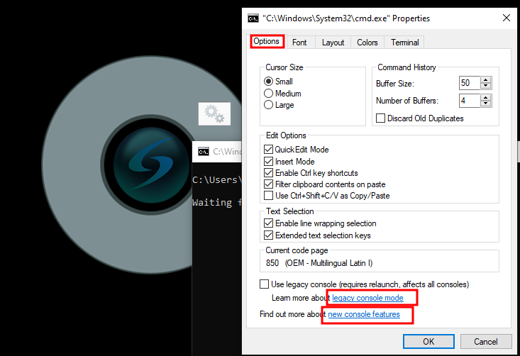
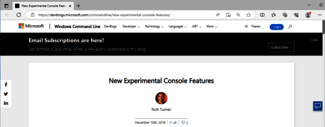
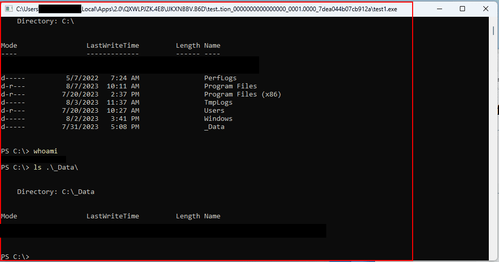
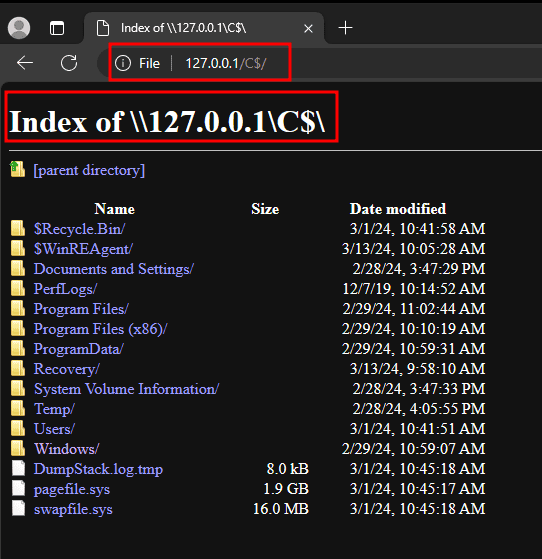

# Inteset Secure Lockdown Multi Application Edition - Schwachstellen und Härtungsmaßnahmen

# Table of Contents
# Einführung

Vor einer Weile hatte die DriveByte GmbH ein Assessment, bei dem das Produkt als Software auf einem mit "Kiosk Mode" geschützten System betrieben wurde. Unseren Mitarbeitern ist es dabei gelungen, einige Schwachstellen in dem Produkt, dass für den Kiosk Modus verwendet wurde zu identifizieren. Diese Schwachstellen werden im folgenden Artikel behandelt. Während unserer Meinung nach der Hersteller für die Behebung der angesprochenen Fehler verantwortlich ist, gibt es dennoch einige Möglichkeiten für Anwender der Software, sich vor diesen Angriffen zu schützen oder ihre Umgebung zumindest sicherer zu machen. Auch wenn es generell unserer Meinung entspricht, die Sicherheit eines Produktes nach Möglichkeit nicht von einem Kiosk Modus abhängig zu machen.
Wie auch in vorhergegangenen Veröffentlichungen, war die DriveByte GmbH sehr interessiert daran, die Schwachstellen in Zusammenarbeit mit dem Hersteller zu bearbeiten und zu veröffentlichen. Allerdings hat der Hersteller nach der ersten Kontaktaufnahme und dem Senden aller relevanten Informationen von unserer Seite nicht mehr auf unsere Kommunikation reagiert.
Nach einiger Zeit, in der wir stetig versucht haben Informationen vom Hersteller zu erhalten, haben wir die Schwachstellen an [CERT/CC's](https://www.kb.cert.org/vuls/) Schwachstellenprogramm "VINCE"(Vulnerability Information and Coordination Environment) gemeldet. Leider konnten auch Sie keinen Kontakt zum Hersteller erreichen. Daher veröffentlichen wir nun in enger Abstimmung mit CERT/CC die identifizierten Schwachstellen.

# Beschreibung

Inteset selbst, beschreibt ihre Software "Secure Lockdown - Multi Application Edition" wie folgt ["Secure Lockdown - Multi Application Edition is a Windows Lockdown Utility that Allows Access to Only Desired Applications from a Highly Customizable Menu"](https://www.inteset.com/secure-lockdown-multi-application-edition). Während sich die Lösung an einigen Punkten als recht wirkungsvoll erweist, konnten die Analysten von DriveByte trotzdem an anderen Stellen Schwachstellen im Produkt aufdecken. Diese sollten unserer Meinung nach von Inteset aufgegriffen und behoben werden.

# Betroffenes Produkt

Im "About"-Tab von Secure Lockdown wird lediglich "Version 2.0" ausgegeben. Es gibt allerdings einen Registry Key `HKCU:\SOFTWARE\Inteset\` der build 2.00.219 angibt. Während unserem initialen Assessment war "Secure Lockdown - Multi Application Edition 2.00.219" ebenfalls die aktuellste Version.


# Das Setup

Fangen wir mit den Einstellungen an. Für unsere Analyse starten wir mit den folgenden Einstellungen. Diese sind nahezu identisch mit denen, die unser Kunde gesetzt hatte. Allerdings haben wir hier noch die "Edge Lockdown" Option aktiviert.
Inteset kategorisiert die Einstellungen in verschiedene Tabs. Starten wir mit `System Lockdown - Local Level`.

Oh, und falls ihr dachtet, das Microsoft Edge geblockt wird, weil der Haken bei Edge nicht gesetzt ist - Das ist nicht der Fall. Kein Häkchen heißt für "Secure Lockdown", dass gar keine Sicherheitsmaßnahmen für Edge gesetzt sind.
Das wäre ein direktes Game-Over. Wir hätten dann einfach die Möglichkeit eine PowerShell zu öffnen, den "legacy mode" zu aktivieren und damit Code Execution zu erlangen, Files zu durchsuchen, schädliche Dateien herunterzuladen und auszuführen usw. 
Aus diesem Grund hielten wir es für angebracht, den "Lockdown" für Edge auch zu aktivieren.
Wie ihr allerdings später sehen werdet, haben wir Wege gefunden schädliche Aktionen auszuführen. Trotz vollem Edge "Lockdown", wie er unten dargestellt ist.


Wie wir sehen, Downloads, Erweiterungen, Einstellungen etc. sind nun alle geblockt. Fullscreen nicht zu erlauben wäre zwingend notwendig gewesen. Aber was solls ;-)

Als nächstes, schauen wir uns die `System Lockdown - Machine Level` Einstellungen an. Wie ihr seht, sind wir auch hier so restriktiv wie möglich.
Außerdem aktivieren wir die `Circle Dock` Option. Diese erlaubt uns, nur den Circle Dock auf dem abgesicherten Bildschirm anzuzeigen (keine Windows Task-Leiste), mit nur den Programmen, die wir erlauben möchten.


Es gibt auch noch weitere Optionen wie `Log off / Restart`, diese dienen aber nur dazu das System neu zu starten und zu definieren nach welchem Zeitraum ein User ausgeloggt wird (ja, genau wie der Name es sagt...).
Wir könnten zusätzlich noch Hintergrundapplikationen konfigurieren. Dies würde dann definieren, welche Prozesse laufen dürfen. Da diese Einstellung von unserem Kunden nicht gesetzt war, haben wir sie auch weder gesetzt noch ausführlich getestet. Was man allerdings wissen sollte, ist das mit diesen Einstellungen einfach **alles** laufen darf.

Ok, jetzt da wir wissen welche Einstellungen gewählt wurden, lasst uns sehen, wie wir Zugriff auf den Edge Browser erlangen und diesen Zugriff dann auch ausweiten können.

# Zugriff auf Edge erlangen

Hier gibt es eine Besonderheit. Die meisten lockdowns bzw. Kiosk Modes die wir bisher gesehen haben, waren recht einfach zu umgehen. Hier allerdings hat unser Bypass eine Vorraussetzung. Die Applikation, die über das `Circle Dock` gestartet wird, muss die `cmd.exe` starten. Das ist es, was wir bei unserem Kunden entdeckt haben. Die Applikation wurde über eine `.bat` Datei gestartet.

Ich weiß, was ihr jetzt denkt! Aaaah ok, wir beenden einfach den Programmstart in der CMD und können uns dann den Terminal-Zugriff zunutze machen. Ganz einfach.

Aber nein, ganz so einfach war es nicht. Wenn wir den Startvorgang des Programms in der CMD abgebrochen haben, bekamen wir in der CMD eine "Zugriff verweigert" Benachrichtigung. Es gibt dennoch Möglichkeiten. Wenn es darum geht, Lockdowns zu umgehen, ist es immer wichtig alle möglichen Menüs etc. in Augenschein zu nehmen, um eventuell ein Weg in den Explorer oder ähnliches zu finden.
In unserem Fall war es mit der Hilfe von CMD möglich, einen Weg zu finden um den Edge Browser zu öffnen (Ja ich weiß, die Überschrift hatte das bereits verraten). 

Wie bereits angemerkt, wurden einige Angriffsoberflächen recht effektiv abgeschaltet. So beispielsweise "Hilfe"-Menüs und andere Standardwege die jeder Analyst als erstes überprüft. Allerdings trifft das auf das Kontextmenü von CMD nicht zu. 
Daher konnten wir mit einem Rechtsklick in die Menüzeile der CMD zugriff auf deren "Eigenschaften" gelangen.


Danach gibt es hier mehrere Möglichkeiten, den als Standard eingestellten Webbrowser zu starten. In unserem Fall war das Edge.

Die ersten zwei Möglichkeiten sind im Tab `Options` zu finden. Wenn man die Links in "Learn more about legacy console mode" oder "Find out more about new console features" klickt, öffnet sich der Edge Browser und ruft die entsprechenden Seiten auf.



Das gleiche gilt für den `Terminal` Tab. Wir können mit dem Link in "Find out more about experimental terminal settings" den Edge Browser starten.




Und schon haben wir Zugriff auf den Browser.

## Behebung

Wie können wir das verhindern? Am einfachsten ist es natürlich, keine `.bat`-Dateien zum Starten von Programmen im Inteset lockdown zu verwenden. Zudem sollte Prozess-Whitelisting so etwas verhindern können. Das haben wir allerdings nicht ausführlich getestet.
Insgesamt sind wir der Meinung, dass das Öffnen von Edge geblockt werden sollte, anstatt es den Anwendenden zu überlassen darauf zu achten, wie sie Programme starten. Das trifft allerdings auf mehrere Schwachstellen in diesem Artikel zu.

Jetzt haben wir also Zugriff auf MS Edge. Und was jetzt? Was können wir damit erreichen? Können wir schädliche Dateien herunterladen und ausführen? Schauen wir mal.

# Ausführung von ClickOnce Applikationen

Die zweite Schwachstelle in "Inteset Secure Lockdown Multi Application Edition" ist, dass sobald wir Zugriff auf Edge haben, beliebigen Code ausführen können.
Die Software blockiert einige Dinge, wie beispielsweise den Zugriff auf die Browsereinstellungen, Downloads etc.


Was allerdings nicht blockiert wird, ist der Download und die Ausführung von sogenannten "ClickOnce" Anwendungen.

Was ist ClickOnce? Microsoft selbst beschreibt ClickOnce wie folgt
"ClickOnce ist eine Bereitstellungstechnologie, mit der Windows-Anwendungen erstellt werden können, die eigenständig aktualisiert und mit minimaler Benutzerinteraktion installiert und ausgeführt werden." - [MSDN](https://learn.microsoft.com/de-de/visualstudio/deployment/clickonce-security-and-deployment?view=vs-2022)

ClickOnce kann für mehrere Angriffe ausgenutzt werden. Wenn ihr mehr darüber erfahren wollt, lest gerne den fantastischen [Blogpost von SpecterOps zu dem Thema](https://posts.specterops.io/less-smartscreen-more-caffeine-ab-using-clickonce-for-trusted-code-execution-1446ea8051c5), den ich während der Analyse auch selbst zurate gezogen habe (es gab auch etwa eine Woche vor unserem Assessment ein Webinar von SpecterOps zu dem Thema. Leider konnte ich aus zeitlichen Gründen nicht teilnehmen und dachte mir "Ach nicht so schlimm, wann werde ich das wohl jemals brauchen". Tja, das habe ich schnell bereut).

In unserem Fall wurde keine Verbotsliste bzw. "Allowlist" für Webseiten definiert. Daher können wir einfach eine simple ClickOnce Anwendung schreiben, hosten und ausführen.

```csharp
using System;
using System.Diagnostics;

namespace ClickOnceTest
{
    internal class Program
    {
        static void Main(string[] args)
        {
            var processStartInfo = new ProcessStartInfo();
            processStartInfo.FileName = "powershell.exe";

            using var process = new Process();
            process.StartInfo = processStartInfo;
            process.Start();
        }
    }
}
```
Klar, wir könnten hier etwas deutlich ausgefeilteres schreiben. Aber hey, das erfüllt seinen Zweck ¯\\_(ツ)_/¯.

Jetzt können einfach die Anwendung hochladen, und sie auf unserem Zielsystem ausführen, um unseren Code zu starten.


Bis die Datei tatsächlich ausführt wird, müssen wir uns durch ein paar Dialoge klicken. Für eine Phishingkampagne wäre das also etwas aufwändig (zumindest, solange wir kein Zertifikat haben, mit dem wir unsere Anwendung signieren können. Oder solange wir nicht anderweitig etwas mehr Aufwand betreiben. Mehr dazu im obigen Blogpost von SpecterOps. Ernsthaft, wir empfehlen wirklich ihn durchzulesen). Für unser Szenario ist das allerdings absolut kein Problem. Da wir physisch am System sind (deswegen ja der Kiosk Modus) und uns einfach selbst durch die Dialoge klicken können.


Uuuuund nachdem wir "Install" klicken, wird unser Code auf dem System ausgeführt und unsere PowerShell gestartet.



Herzlichen Glückwunsch, wir können also jeden Code ausführen, den wir ausführen wollen.

## CVE Information

MITRE hat hierfür [CVE-2024-29500](https://cve.mitre.org/cgi-bin/cvename.cgi?name=2024-29500) vergeben.

## Behebung

Auch hier sind wir der Meinung, dass dieses Problem vom Hersteller behoben werden sollte. Zumindest sollte es eine Option zum Verhindern von ClickOnce Ausführungen geben.
Aber bis dahin, könnt ihr die Ausführung von ClickOnce mit den Registry Key Einstellungen in `\HKEY_LOCAL_MACHINE\SOFTWARE\Microsoft\.NETFramework\Security\TrustManager\` verhindern. Mehr Informationen dazu sind auch in [diesem MSDN Artikel](https://learn.microsoft.com/de-de/visualstudio/deployment/how-to-configure-the-clickonce-trust-prompt-behavior?view=vs-2022&tabs=csharp) zu finden.

# PowerShell wird nicht blockiert

Wer bis hierhin aufmerksam gelesen hat, hat es vermutlich schon erkannt. Also machen wir es hier kurz.
Wenn CMD für ein Problem gehalten und blockiert wird, sollte auch PowerShell blockiert werden. Wir wissen, dass das nicht ganz einfach ist. Aber für einen "Secure Lockdown", sollte das definitiv in Betracht gezogen werden.

Wir mussten diese Schwachstelle zwar mit dem Aufrufen von Edge und dem Ausführen von ClickOnce Anwendungen verbinden (was uns dann ja ohnehin bereits die Ausführung von beliebigem Code ermöglicht), trotzdem sollte PowerShell einfach grundlegend blockiert werden.

## Behebung

Unserer Meinung nach sollte dieses Problem von Inteset bearbeitet werden. 
Ansonsten gibt es zahlreiche Informationen zu Gruppenrichtlinien, mit denen PowerShell und PowerShell_ISE blockiert werden können.

# Lesen beliebiger lokaler Dateien

Es gibt auch noch eine weitere Schwachstelle, die wir ausnutzen können, sobald wir einen Browser aufrufen können. Während man darüber streiten kann, ob die vorher genannten Schwachstellen eher Konfigurationsprobleme oder Schwachstellen in "Secure Lockdown" sind, ist das hier definitiv eine Schwachstelle.

Wie wir bereits in den Screenshots im Kapitel ClickOnce gesehen haben, sind `file` Links nicht zugelassen.



Das kann aber mit sogenannten `UNCPaths` wie `\\127.0.0.1\C$` umgangen werden. Somit können wir das Dateisystem zugreifen und alle Dateien lesen, auf die der Benutzer unter dem "Secure Lockdown" ausgeführt wird, Berechtigungen hat. 

## CVE Information

MITRE hat hierfür [CVE-2024-29502](https://cve.mitre.org/cgi-bin/cvename.cgi?name=2024-29502) vergeben.

## Behebung

Wir hoffen natürlich, dass Inteset diese Schwachstellen behebt. Trotzdem empfehlen wir, falls möglich, einen "allowlist" Ansatz zu verwenden um nur bestimmte Seiten für Anwendende zuzulassen.

In unserem Test erwies sich das als effektiv.


Das konfigurieren einer Allowlist kann (wenn sie minimalistisch gehalten und gepflegt wird) zudem die Angriffsoberfläche für den ClickOnce Vektor verringern.


# Schlusswort

Es kann wie gesagt darüber gestritten werden, ob diese Schwachstellen vom Hersteller behoben werden sollten, oder einfach Konfigurationsfehler sind. Unserer Meinung nach sind das allerdings ernste Probleme, die die meisten Anwendenden vermutlich einfach nicht auf dem Schirm haben (oder wie viele Leute kennt ihr, die ClickOnce unterbinden?).
Daher vertreten wir die Überzeugung, dass der Hersteller diese Maßnahmen standardmäßig umsetzen sollte.
Wir haben in einer realen Situation gesehen, wie wir durch diese Schwachstellen von "nur Zugriff auf die Applikation" zu "wir können beliebigen Code ausführen" gekommen sind. Wir denken daher, dass diese Probleme ernstgenommen werden sollten.
Wie ihr vielleicht in vorhergegangenen Blogposts gesehen habt, sind wir immer sehr daran interessiert, gefundene Schwachstellen in enger Kooperation mit den Herstellern zu beheben und dann zu veröffentlichen, vor allem unter dem Motto "Responsible Disclosure". Leider war uns das in diesem Fall nicht möglich. Der Hersteller reagierte zwar auf unsere initiale Anfrage, meldete sich aber danach nie wieder zurück.

Daraufhin haben wir das CERT/CC eingeschaltet, die auch vergeblich versuchten mit dem Hersteller in Kontakt zu treten. 

Da wir beide erfolglos geblieben sind, veröffentlichen wir die Schwachstellen jetzt in enger Kooperation mit CERT/CC.
Wir glauben, dass diese Probleme Anwendenden und "Defendern" bekannt sein sollten, da sie für die meisten Schwachstellen auch selbst aktiv werden können, um die Risiken drastisch zu reduzieren oder die Schwachstellen gar ganz zu beheben.

# Danksagung

Unser besonderer Dank gilt dem CERT/CC Team für ihre Bemühungen uns mit dem Hersteller in Kontakt zu bringen um die Probleme gemeinsam zu lösen.

# Disclosure Timeline 

29.09.2023 - Initialer Kontakt mit der Frage in welcher Form Schwachstellen gemeldet werden sollen  
29.09.2023 - Der Hersteller antwortet, das Schwachstellen einfach an die support-E-Mail Adresse gesendet werden sollen  
04.10.2023 - Initiale Meldung der Schwachstellen  
30.10.2023 - DriveByte fragt Neuigkeiten beim Hersteller an  
24.11.2023 - DriveByte fragt Neuigkeiten beim Hersteller an  
08.12.2023 - Die Schwachstellen werden mittels CERT/CC's VINCE gemeldet  
09.01.2024 - DriveByte fragt Neuigkeiten beim Hersteller an   
26.01.2024 - CERT/CC schaltet sich ein  
13.02.2024 - CERT/CC teilt uns mit, dass wir uns für eine Veröffentlichung am 10. März bereitmachen sollen  
08.03.2024 - Finale Bestätigung, dass die Veröffentlichung bis auf weiteres auf den 10. März geplant ist, sofern der Hersteller sich nicht in das Verfahren einklinkt
14.03.2024 - Finales Release  
24.04.2024 - Update: CVE Informationen wurden hinzugefügt

