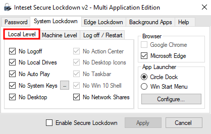
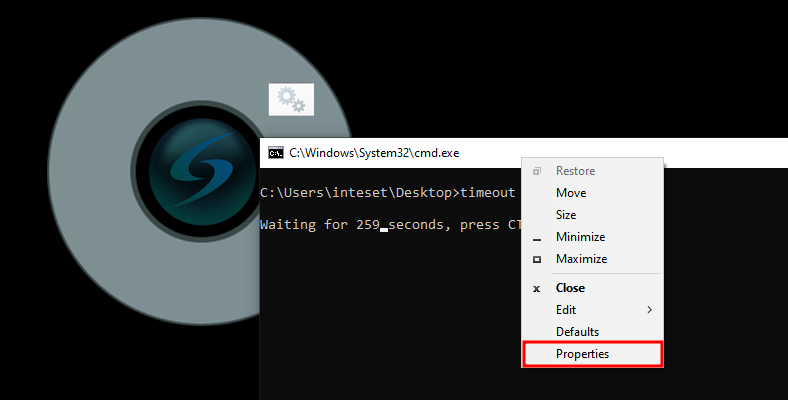
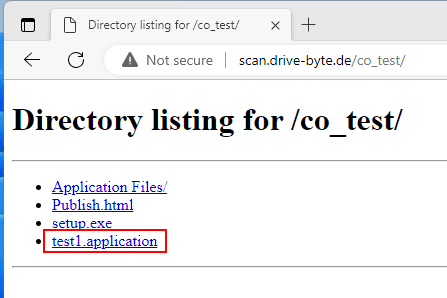
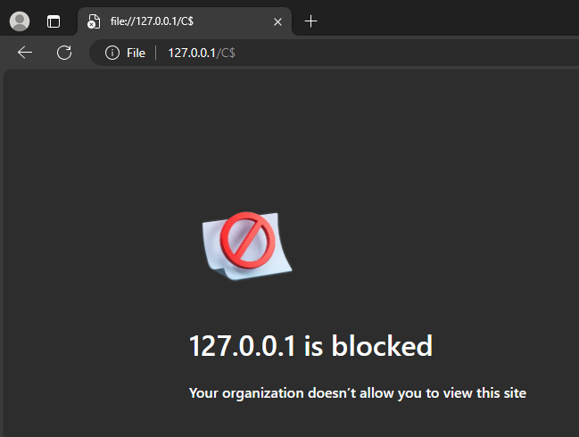

# Inteset Secure Lockdown Multi Application Edition - Vulnerabilities and Hardening Measures

Caution: This BlogPost is replicated here from my old company (with permission) as the company will be closed and I wanted to avoid that the articles vanish.

# Introduction
A while ago, I stumbled across a kiosk mode application during an assessment. The team was able to find some issues within the kiosk mode, that will be addressed in the following article. While it is my personal opinion, that these issues should be addressed by the vendor, I still list some mitigating measures that can be taken by users to at least reduce the risk while using the product. Generally speaking, if you can, you should avoid relying on a kiosk mode for the security of your applications. 
As always, I tried addressing the vulnerabilities with the vendor responsibly, within the context of a coordinated vulnerability disclosure. However, after initial contact and sending a description of the vulnerabilities; Radio Silence! 
Over time, still trying to address and disclose the issues with the vendor, I reported the issues to [CERT/CC's](https://www.kb.cert.org/vuls/) VINCE. 
Sadly they have not been able to get in touch with Inteset as well. Therefore, in coordination with CERT/CC, I disclose my findings in this article.
# Description
Inteset itself describes "Secure Lockdown - Multi Application Edition" as follows "[Secure Lockdown - Multi Application Edition is a Windows Lockdown Utility that Allows Access to Only Desired Applications from a Highly Customizable Menu](https://www.inteset.com/secure-lockdown-multi-application-edition)". While the solutions seemed quite effective on some edges, I found some vulnerabilities within the software, that should be taken care of by the vendor.
So let's take a look at the findings.
# Affected Product
In its "About"-Tab Secure Lockdown only states "Version 2.0". However, there is a registry key ` HKCU:\SOFTWARE\Inteset\` that indicates the version is 2.00.219.
During the original assessment, "Secure Lockdown - Multi Application Edition 2.00.219" was the most recent and assessed version as well. By the time of writing of this blogpost, the version had not changed.


# The Setup
Let's start with the setup. For my assessment I started with the following options, that are almost similar to what our customer had configured, with the difference, that I enabled the Microsoft Edge options here.
Inteset offers some categories for their settings. Let's start with the `System Lockdown - Local Level`.



Oh, and if you think that Edge is blocked in general, if it's box is unchecked - it isn't. Unchecked means, that there is no protection for Edge at all. 
This would mean instant Game-Over, as we'd have a lots of options like just opening PowerShell, enabling legacy mode and ActiveX for code execution, browsing files, downloading and executing malicious files etc.
That's why we chose to "Lockdown" Edge as well.
However, as you will see later, there are still some attack vectors, even with the full Edge lockdown mode as shown 


As we can see: downloads, extensions, settings etc. are all blocked now. It wouldn't have been necessary to prevent fullscreen. But that's not the point here.

Next we can take a look at the `System Lockdown - Machine Level` options. As you can see we are also denying as much as possible. 
Further we activate the `Circle Dock` option. This allows us to have just the Circle Dock on screen and no other options (no Windows Taskbar) besides the ones we want to give to the user.


There are also other options, like `Log off / Restart`, but this is just if the system should restart and the time after which a user will get logged off (yes, as the name says... I know).
Further we could define background apps, that are allowed to run. In my case I did not test anything of this, as it was not configured by the customer. What is to be stated here is, that in this mode **EVERYTHING** can run in the background.

Alright, now that we know how the setup looks like, let's see how we can get access to an Edge browser.

# Getting Access to Edge

So this one has a catch. Most lockdowns or kiosk modes I've seen so far have been quite easy to bypass. In this case however, the escape relies on a precondition. The application started from the `Circle Dock` has to call `cmd.exe`. In the case of the customer, they started their program as a `.bat` file.

I know what you're thinking right now. Aaaah ok, just cancel the task in the CMD and you can access it. Easy as cake.


But no. It was not as easy as that. Cancelling the running task did lead to an "Access Denied" error. However, there are other methods. When bypassing lockdowns, it is always important to check for all kinds of menus and stuff to see if we can escape into an explorer etc. 
In my case, with the help of CMD. I found a way to get access to Edge (yes, exactly as the heading states it. Surprise surprise).

So as mentioned already, a lot of things have been locked down quite well. Help menus and other standard ways that every security person checks first. However, the context menu of CMD was not. 
Therefore I could just right click the menu bar of CMD and then access the properties.



Afterwards, the properties offer some possibilities to start the default web browser, which was MS Edge in my case. 

The first two opportunities are in the `Options`-tab. By clicking the links in "Learn more about legacy console mode" or "Find out more about new console features", MS Edge opens with the help/info pages about those topics.


The same goes for the "Terminal"-tab. Here we can "Find out more about experimental terminal settings". And we can do this with the default browser of course.


And now we have access to the Browser. 

## Solution

How can we prevent this? Well, the easiest of course is avoiding to use `.bat` files to start your programs within Inteset. On the other hand, the process whitelisting function could prevent things like this from happening, but I did not test this. 
Altogether I think it should be blocked by the software itself and not left to the user to fix. But that goes for the other issues mentioned in this blogpost as well. 

So now we have access to Edge. But what now? What to do with that? Can we download and execute malicious files? Let's see.

# Execution of ClickOnce Applications

The second issue I have with "Inteset Secure Lockdown Multi Application Edition", is that once we got access to Edge, we get code execution.
Even though the software is blocking a lot of things, like browser settings, downloads etc.


It does not block the download and execution of so called "ClickOnce" applications. 

What is ClickOnce? Well, here's a description from Microsoft.

"ClickOnce is a deployment technology that enables you to create self-updating Windows-based applications that can be installed and run with minimal user interaction" - [MSDN](https://learn.microsoft.com/en-us/visualstudio/deployment/clickonce-security-and-deployment?view=vs-2022)

ClickOnce can be abused for a lot of things. Check out the amazing [blogpost](https://posts.specterops.io/less-smartscreen-more-caffeine-ab-using-clickonce-for-trusted-code-execution-1446ea8051c5) about this from SpecterOps, which is what I did during this assessment as well (there was also a webinar about it from SpecterOps just a week before our assessment. But I couldn't make it and thought "aah, I will probably never need it anyways"... yeeeeah... I regretted that).

In my case, as there is no deny list for websites, we can just write a simple ClickOnce application and run it. 

```csharp
using System;
using System.Diagnostics;

namespace ClickOnceTest
{
    internal class Program
    {
        static void Main(string[] args)
        {
            var processStartInfo = new ProcessStartInfo();
            processStartInfo.FileName = "powershell.exe";

            using var process = new Process();
            process.StartInfo = processStartInfo;
            process.Start();
        }
    }
}
```

Sure, we could write much more sophisticated stuff here. But I'm lazy ¯\\_(ツ)_/¯.

Afterwards we can just host the ClickOnce on our server and download/execute it on the target machine for code execution.



We have to click a few times during this overall process. So for a phishing campaign this would be bit of a hassle (as long as we cannot sign it or do bit more sophisticated stuff like the awesome team from SpecterOps. Seriously, check out the mentioned blogpost). But for our scenario, in which we are the clicking user on a locked down system ourselves, this is no hassle.


Aaaaand after clicking "Install" we get our code executed and launch (in our case) our powershell.


Congratulations, we can now execute arbitrary code.

## CVE Information

MITRE assigned [CVE-2024-29500](https://cve.mitre.org/cgi-bin/cvename.cgi?name=2024-29500) for this issue.

## Solution

Again, I think that the solution should be automated by the vendor. Or at least be added as an option within the lockdown settings. 
But till then, you can disable ClickOnce executions with the registry key settings in `\HKEY_LOCAL_MACHINE\SOFTWARE\Microsoft\.NETFramework\Security\TrustManager\`. For more information about the remediation you can also refer to [the MSDN article about this topic](https://learn.microsoft.com/en-us/visualstudio/deployment/how-to-configure-the-clickonce-trust-prompt-behavior?view=vs-2022&tabs=csharp)

# No Restriction of Powershell

Who was paying attention in the last chapter probably already recognized it. So I make this one short. 
If you think CMD is a problem and you block it, you should block powershell as well. I know this isn't that easy, but for a "Secure Lockdown", this definitely should be considered.

I had to combine this vulnerability with the access to Edge and the execution of ClickOnce applications (which led us to having code execution anyways). Still powershell access should just get blocked.

## Solution

In my opinion, this one really is up to inteset.
Besides that, there is plenty information out there regarding group policies to block powershell and powershell_ise.

# Local File Read

There's also another vulnerability that we can abuse as soon as we have access to a browser. While one can argue about if other topics are software or user configuration issues, this one is a bug for sure.

We could see on screenshots in the ClickOnce chapter, that `file` links are not allowed in "inteset Secure Lockdown Multi Application Edition".


However, this can be bypassed by using `UNCPaths` like `\\127.0.0.1\C$`. This way we can access the filesystem and read any file, the useraccount which runs Inteset has access to.

## CVE Information

MITRE assigned [CVE-2024-29502](https://cve.mitre.org/cgi-bin/cvename.cgi?name=2024-29502) for this issue.

## Solution

Besides hoping for Inteset fixing those issues, if it is possible for you, I suggest to use a whitelist to restrict the access to only pages you want people to access.

In my test, this proved effective against this attack.




Using an allowlist will also (if kept clean and minimalistic) reduce your attack surface for the ClickOnce attack vector.
# Closing Statement

It's open for discussion, if these issues are bugs that have to be patched by the vendor. In my opinion, these are serious attack vectors that most users probably don't know of (how many people do you know that restricted ClickOnce execution?), therefore I believe the manufacturer is responsible for providing a fix for this issues.
We've experienced in a live environment how we could get from locked down to code execution with above vulnerabilities. We therefore think, that these vulnerabilities should be taken seriously.
As you've seen in my previous blogposts, I am usually very interested to disclose issues in close cooperation with the vendor. Sadly this did not work this time. While the vendor responded to my initial contact, I never again got any response. I then involved CERT/CC, who in turn also tried to reach the vendor.

As we both were unsuccessful, I am now disclosing the vulnerabilities in tight coordination with CERT/CC and in accordance with requirements of the responsible disclosure of vulnerabilities.
I believe that these issues should be known to users and defenders as they are able to reduce the attack possibilities drastically or even remediate some of them completely.

# Acknowlegdements

Special thanks goes to the CERT/CC team for supporting me along the way and trying their best to get the vendor to be involved in the case.

# Disclosure Timeline 

2023/09/29 - Initial contact with the question where to report the bugs  
2023/09/29 - Vendor response to just send it to the support mail address  
2023/10/04 - Initial Bug Report  
2023/10/30 - DriveByte requested the vendor for updates  
2023/11/24 - DriveByte requested the vendor for updates  
2023/12/08 - Case opened in CERT/CC's VINCE  
2024/01/09 - DriveByte requested the vendor for updates  
2024/01/26 - CERT/CC jumps in  
2024/02/13 - CERT/CC tells us to prepare for public release on 10th of march  
2024/03/08 - Final confirmation for release on the 10th of march until further notice  
2024/03/14 - Final release  
2024/04/24 - Updated CVE information

